# 🛒 Derafsh E-Commerce

A modern, responsive e-commerce platform built with React, TypeScript, and modern frontend technologies.

Derafsh E-Commerce is a complete online shopping experience designed for browsing products, viewing product details, managing shopping carts, and providing a smooth user experience across desktop, tablet, and mobile devices.

The project focuses on clean UI design, responsive layouts, reusable components, and a scalable frontend architecture.

---

## 🚀 Live Demo

🌐 Website:

https://derafsh-ecommerce.saeed-motevalli25.workers.dev/

---

## 📌 About The Project

Derafsh E-Commerce was developed as a real-world frontend project to simulate a modern online store.

The main focus of this project was:

- Building a professional e-commerce interface
- Creating reusable React components
- Developing responsive layouts for all devices
- Managing different application states
- Designing clean and maintainable frontend architecture
- Deploying the application using Cloudflare Workers

The website automatically adapts to desktop, tablet, and mobile screens.

# 📸 Screenshots

## 🏠 Home Page

### Desktop

<div align="center">


</div>


### Mobile

<div align="center">


</div>


---

# 👤 Account Pages

Authentication pages with login and signup experience.

## Desktop

<div align="center">


</div>


## Mobile

<div align="center">

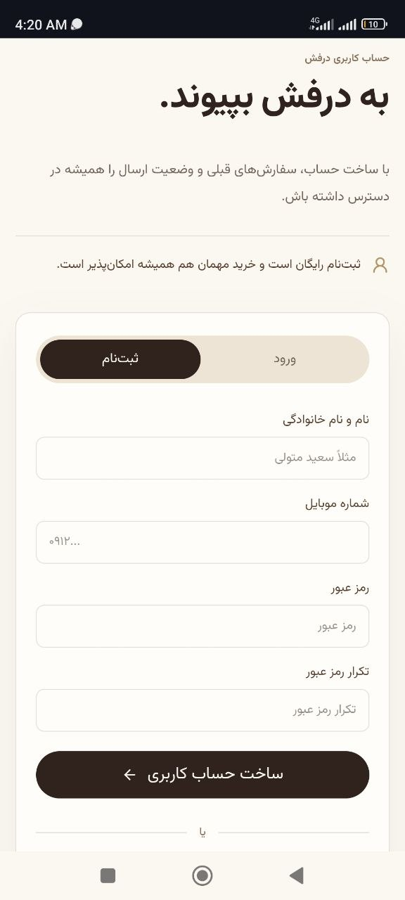

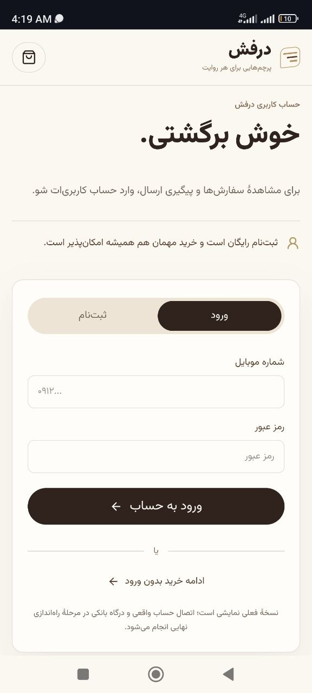

</div>


---

# 🌎 Countries & Product Categories

Country selection pages and product browsing experience.

## Desktop

<div align="center">


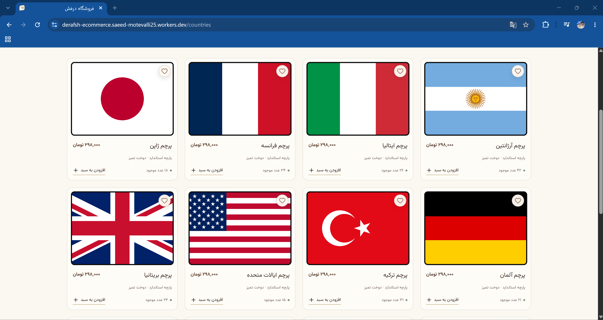

</div>


## Mobile

<div align="center">


</div>


---

# 🛍️ Product Details

Product pages include:

- Product information
- Country details
- Quality information
- Recommendations
- Customer feedback


## Desktop

<div align="center">


</div>


## Mobile

<div align="center">


</div>


---

# 🛒 Shopping Cart

Cart experience with empty and filled states.


## Empty Cart

<div align="center">


</div>

<div align="center">
        


</div>


## Full Cart

<div align="center">


</div>

<div align="center">

</div>


---

# 📦 Bulk Purchase

Bulk ordering experience for customers.


## Desktop

<div align="center">

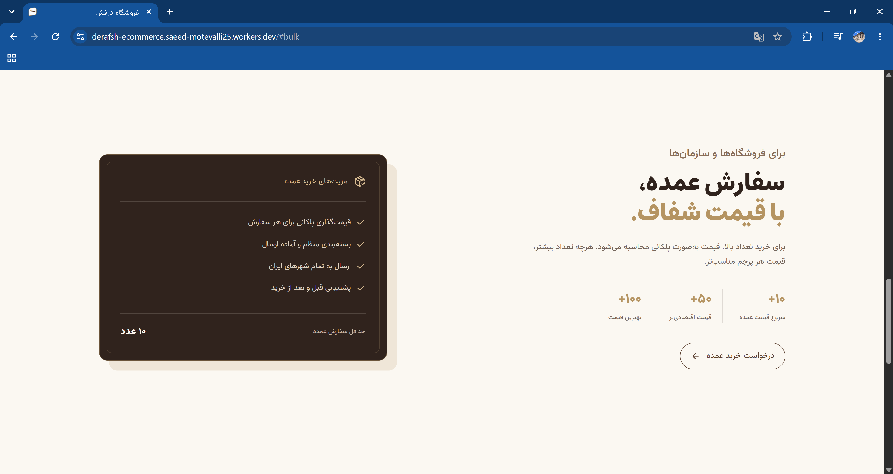

</div>


## Mobile

<div align="center">

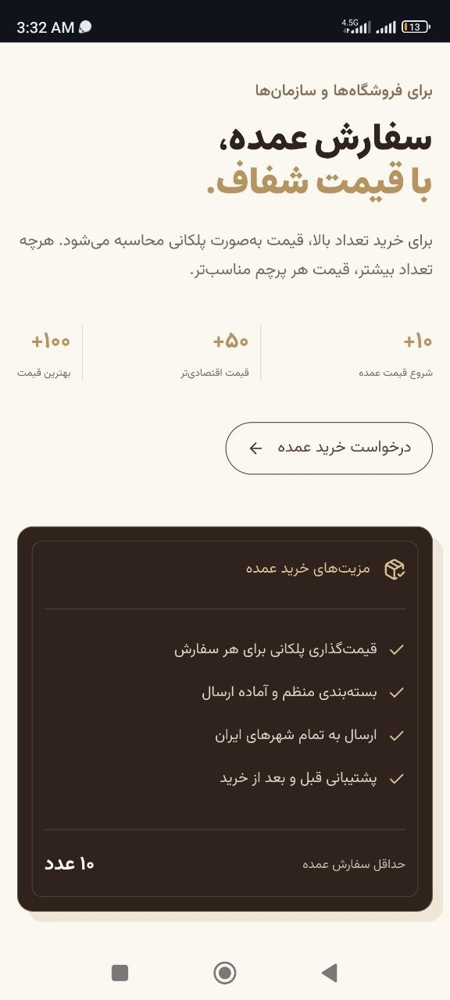

</div>


---

# 💬 Comments Section

Customer reviews and feedback interface.


## Desktop

<div align="center">

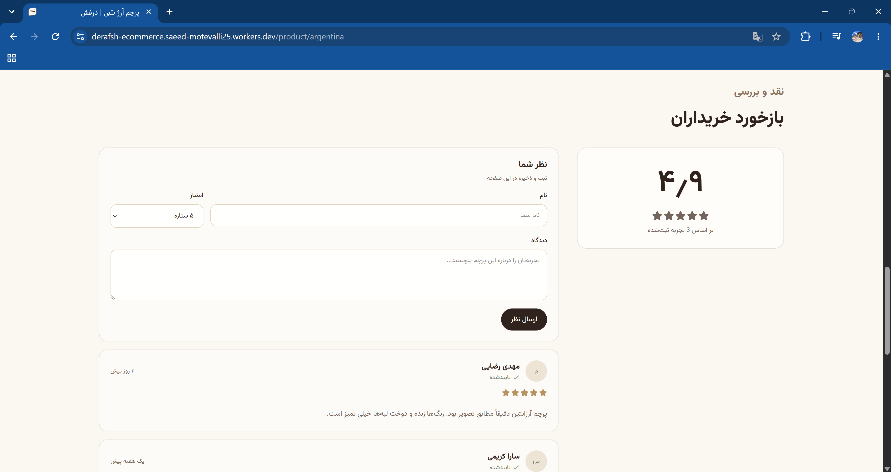


</div>


## Mobile

<div align="center">

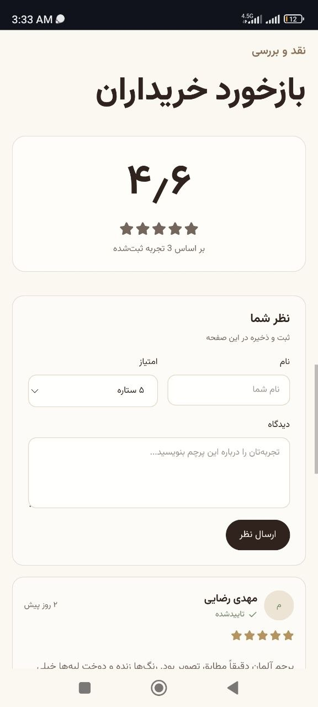

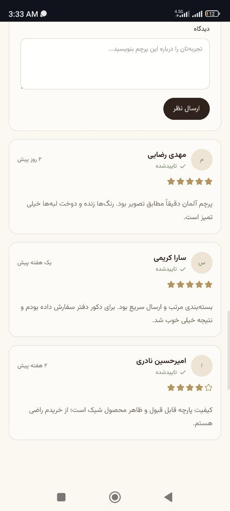

</div>


---

# 🏠 About Page

Brand information and company introduction.


## Desktop

<div align="center">

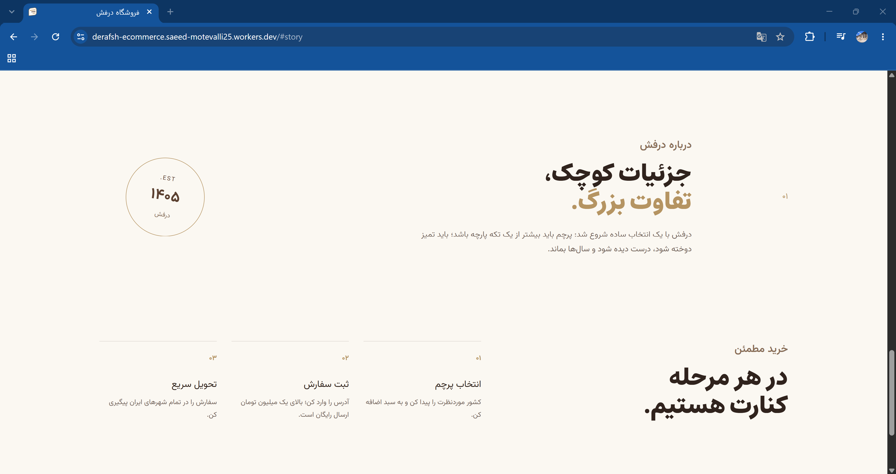

</div>


## Mobile

<div align="center">

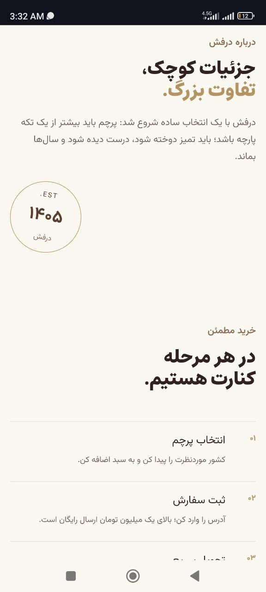

</div>


---

# 🛒 Side Cart

Cart sidebar interface.


## Desktop

<div align="center">

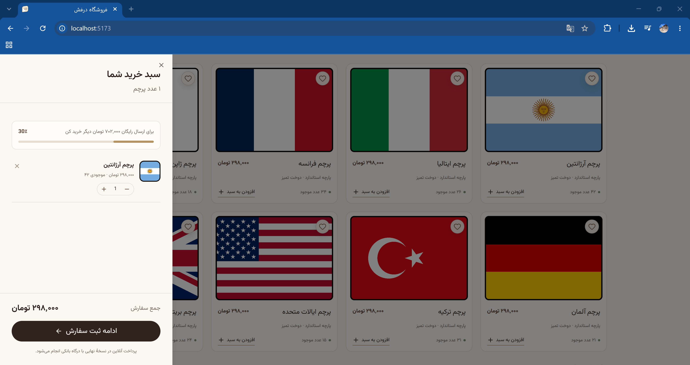

</div>


## Mobile

<div align="center">

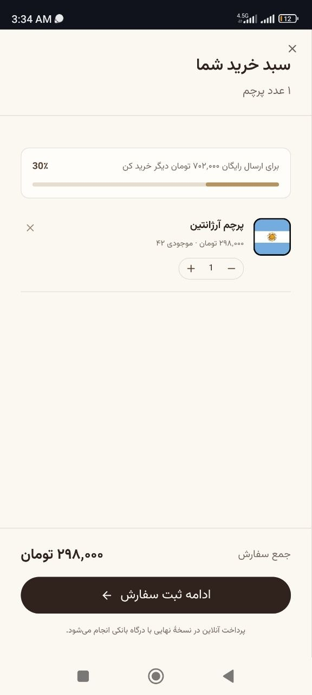

</div>


---

# 💡 Suggestion Section

Product suggestion experience.


## Mobile

<div align="center">

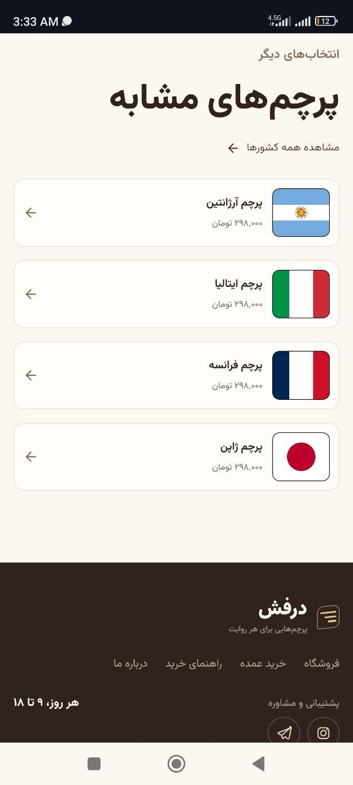

</div>

# ✨ Features

## 🏠 Home Page

- Modern landing page design
- Hero section
- Country-based flag categories
- Brand introduction sections
- Bulk purchase section
- Customer comments section
- Responsive footer design

---

## 🛍️ Product Experience

- Product listing pages
- Product detail pages
- Country information sections
- Product recommendations
- Customer reviews/comments
- Responsive product layouts

---

## 🛒 Shopping Cart

- Add products to cart
- Cart management
- Empty cart state
- Completed cart experience
- Mobile-friendly cart interface

---

## 👤 User Account

- Login page
- Signup page
- Account interface
- Responsive authentication layouts

---

# 📱 Responsive Design

The project uses a responsive web design approach instead of a separate mobile application.

Supported layouts:

✅ Desktop  
✅ Tablet  
✅ Mobile  

Every section has been optimized for different screen sizes.

---

# 🛠️ Technologies Used

## Frontend

- React
- TypeScript
- Next.js / Vinext
- Vite
- Tailwind CSS
- Lucide React Icons

## Backend & Infrastructure

- Cloudflare Workers
- Cloudflare D1 Database
- Drizzle ORM

## Development Tools

- Git
- GitHub
- ESLint
- Prettier

---

---

# 📂 Project Structure

```
derafsh/
│
├── app/                    # Application routes and pages
│   ├── account/            # User authentication pages
│   ├── cart/               # Shopping cart pages
│   ├── countries/          # Country sections
│   ├── product/            # Product pages
│   ├── layout.tsx          # Global layout
│   └── page.tsx            # Home page
│
├── components/             # Reusable React components
│
├── hooks/                  # Custom React hooks
│
├── lib/                    # Shared utilities
│
├── public/                 # Static assets
│
├── db/                     # Database configuration
│
├── drizzle/                # Database schema and migrations
│
├── worker/                 # Cloudflare Worker files
│
├── package.json
├── vite.config.ts
├── tsconfig.json
└── README.md
```

---

# 🎯 Project Goals

The main goals of this project:

- Creating a production-style e-commerce interface
- Improving React and TypeScript skills
- Practicing scalable frontend architecture
- Building reusable UI components
- Learning modern deployment workflows

---

# 🧩 Development Approach

During development, the project followed:

- Component-based architecture
- Responsive-first design
- Clean separation of logic and UI
- Reusable components
- Maintainable folder structure
- Modern frontend development practices

---

# 🚀 Deployment

The application is deployed using:

**Cloudflare Workers**

Deployment workflow:

```
GitHub Repository
        ↓
Cloudflare Build System
        ↓
Cloudflare Workers Deployment
        ↓
Live Website
```

---

# 👨‍💻 Author

## Saeed Motevalli

Frontend Developer

GitHub:

https://github.com/Saeed-Motevalli
