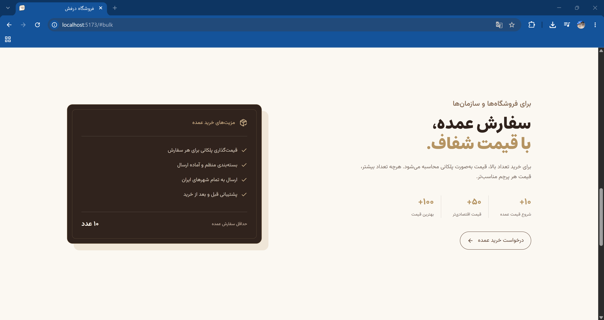
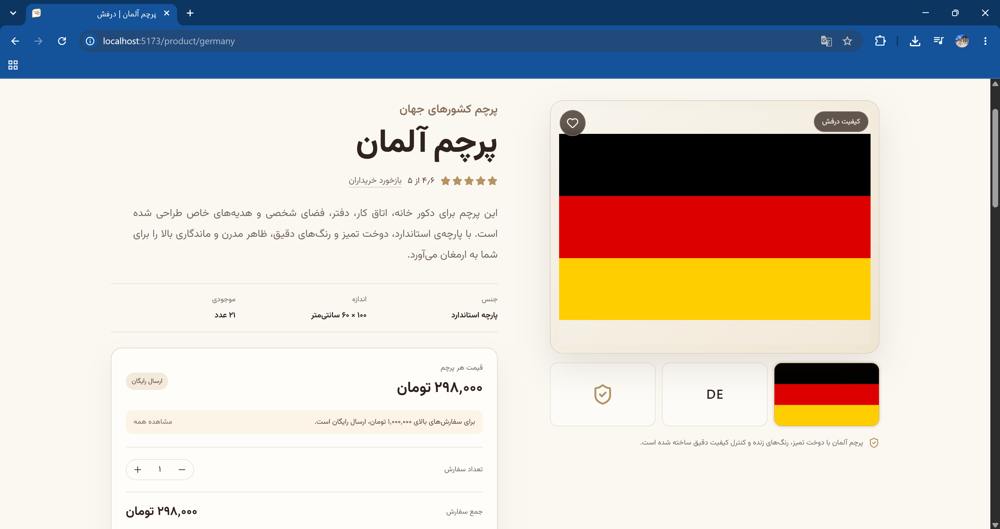
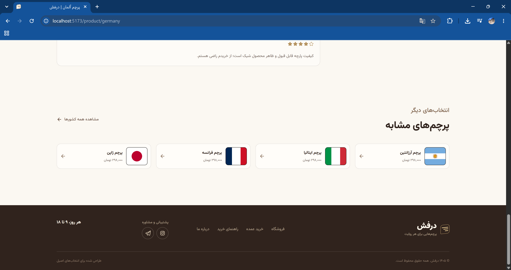
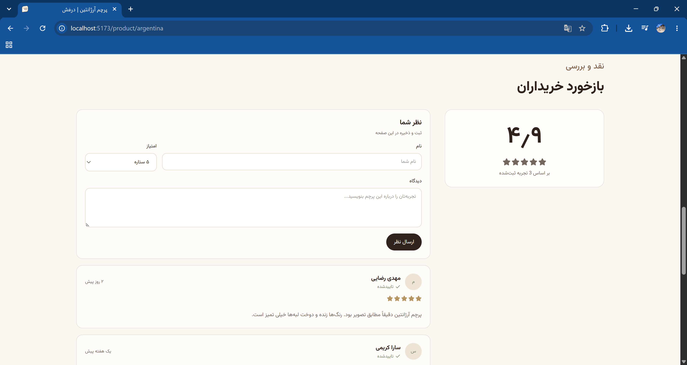
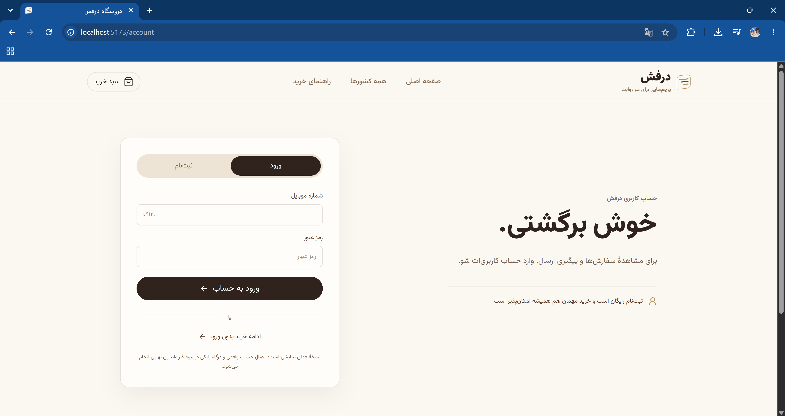

# 🛒 Derafsh E-Shopping

A modern and responsive e-commerce website built with modern frontend technologies.

Derafsh E-Shopping is a complete online shopping platform focused on providing a clean, intuitive, and responsive user experience across desktop, tablet, and mobile devices.

The project includes product browsing, product details, shopping cart functionality, user account pages, country-based sections, and a modern component-based architecture.

---

## 🚀 Demo

(Add your live demo link here)

---

## 📌 About The Project

This project was created to practice and implement a production-style e-commerce experience with a focus on:

- Modern frontend architecture
- Responsive web design
- Reusable React components
- Clean UI development
- Scalable project structure
- User-friendly shopping experience

The website is fully responsive and automatically adapts to different screen sizes.

---

# ✨ Features

## 🛍️ Shopping Experience

- Browse products
- View detailed product pages
- Product recommendation sections
- Country-based product information
- Product comments section

## 🛒 Shopping Cart

- Add and manage products
- Empty cart state
- Filled cart experience
- Cart sidebar interface

## 👤 User Account

- Login page
- Registration page
- User account section

## 📱 Responsive Design

The project does not use a separate mobile application.

Instead, it uses a responsive web design approach:

- Desktop optimized layout
- Tablet support
- Mobile-friendly interface

The UI automatically adjusts based on the user's screen size.

---

# 🛠️ Technologies Used

- React
- TypeScript
- Next.js / Vinext
- Vite
- Tailwind CSS
- Cloudflare Workers
- Cloudflare D1 Database
- Drizzle ORM
- Lucide React Icons

---

# 📸 Screenshots

## 🏠 Home Page

The main landing page includes the shopping experience, bulk shopping section, brand/story sections, and footer design.



---

## 🛍️ Product Experience

Product pages include product information, country sections, recommendations, and customer feedback.







---

## 🛒 Shopping Cart

The shopping cart provides different states including an empty cart and a completed shopping experience.


---

## 👤 Account Pages

Users can access authentication pages including login and registration.




---

# 📂 Project Structure

```
derafsh/
│
├── app/                    # Application routes and pages
│   ├── account/            # Login and signup pages
│   ├── cart/               # Shopping cart pages
│   ├── countries/          # Country-based sections
│   ├── product/            # Product detail pages
│   ├── layout.tsx          # Global application layout
│   └── page.tsx            # Home page
│
├── components/             # Reusable UI components
│
├── lib/                    # Shared utilities and helpers
│
├── hooks/                  # Custom React hooks
│
├── public/                 # Static assets and images
│
├── db/                     # Database configuration
│
├── drizzle/                # Database schema and migrations
│
├── worker/                 # Cloudflare Worker configuration
│
├── package.json            # Dependencies and scripts
├── vite.config.ts          # Vite configuration
├── tsconfig.json           # TypeScript configuration
└── README.md               # Project documentation
```

---

# ⚙️ Installation & Setup

## 1. Clone the repository

```bash
git clone YOUR_REPOSITORY_URL
```

## 2. Install dependencies

```bash
npm install
```

## 3. Start development server

```bash
npm run dev
```

The project will run locally.

---

# 📦 Production Build

To create a production build:

```bash
npm run build
```

---

# 🎯 Project Goals

The main goals of this project were:

- Building a professional e-commerce interface
- Creating reusable and maintainable components
- Practicing scalable frontend architecture
- Improving responsive design skills
- Developing a real-world shopping experience

---

# 🧩 Development Approach

During development, the project focused on:

- Component-based architecture
- Separation of concerns
- Responsive layouts
- Clean folder organization
- Modern frontend best practices

---

# 👨‍💻 Author

**Saeed Motevalli**

Frontend Developer

GitHub: [Saeed-Motevalli](https://github.com/Saeed-Motevalli)
